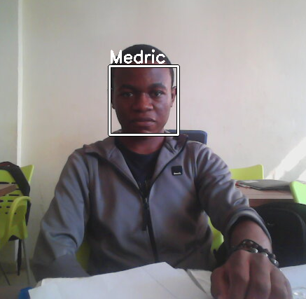

# Facial Recognition
A program created to train a DL model in order to recognize people on images. The model will be trained on photos of these people, and then will be able to recognize any of these people on any image.
This program uses **[Keras](https://keras.io/)** to create its neural network and **[OpenCV](https://opencv.org/)** (cv2) for image processing.

## How do we train the model ?
Add images of heads of these people in the folder **images/**. Each group of photos (
preferably the photos of head) of each person must be placed in a folder named by this person's name.
After that, train our model by executing this command in the project root
```shell
   python3 trainer.py
```

## How do we use the model for recognition ?
Execute this command in the project root
```shell
   python3 main.py path/to/image.jpg
```
Where **path/to/image.jpg** is the path to the image whose we want to test.

## Example



