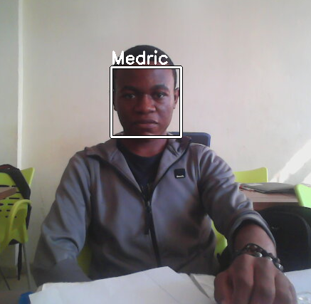

# Facial Recognition
This is a program created to train a model in the recognition of some people on an image. This model will be trained from  photos of these people, and after will able to recognize any of these people on any image.

## How do we train the model ?
First of all, we should add images of these people in the folder **images/train**. Each group of photos of each person must be placed in a folder named by this person's name.
After that, we must train our model by executing this command in the root project
```console
   python3 trainer.py
```

## How do we use the model for recognition ?
After that our model be trained, we must execute this command in the root of the project
```console
   python3 main.py path/to/image.jpg
```
Where **path/to/image/jpg** is the path to the image that we want to test.

## Example



